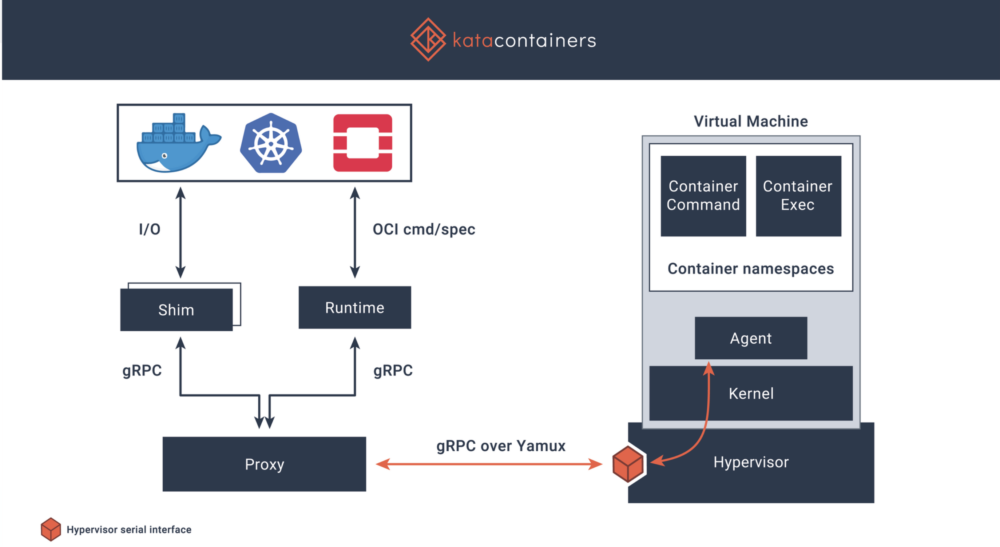
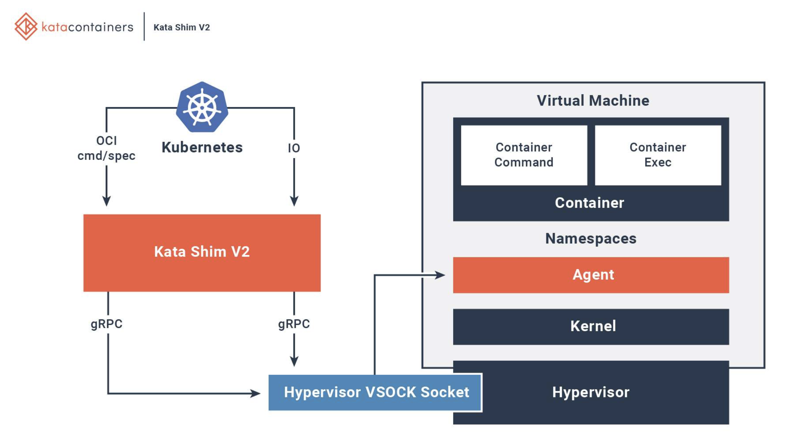
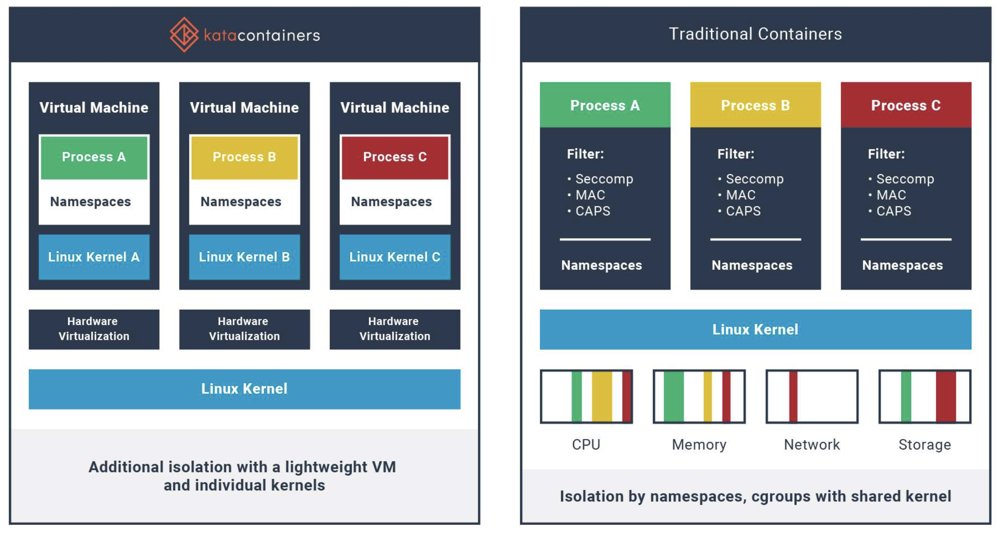
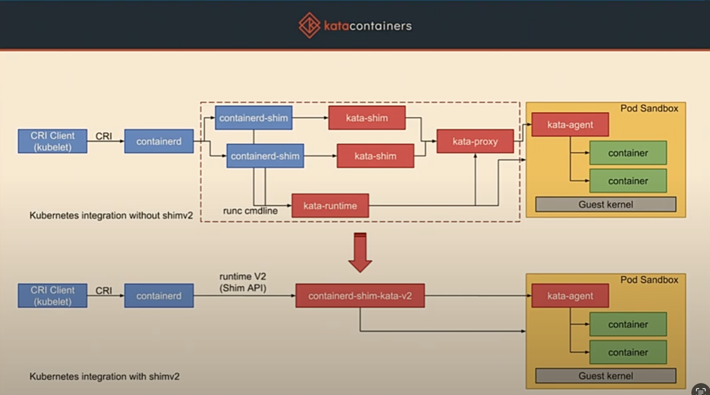
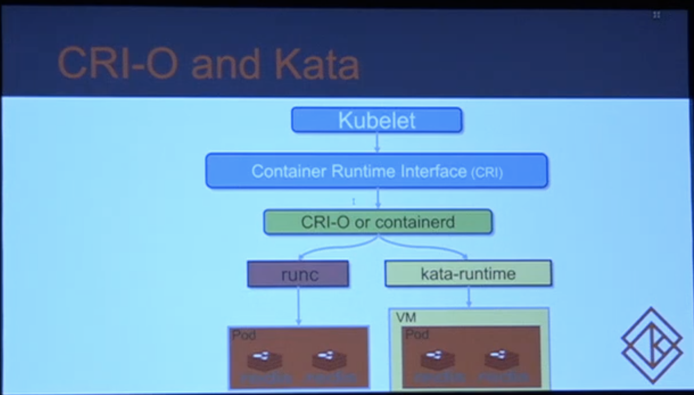
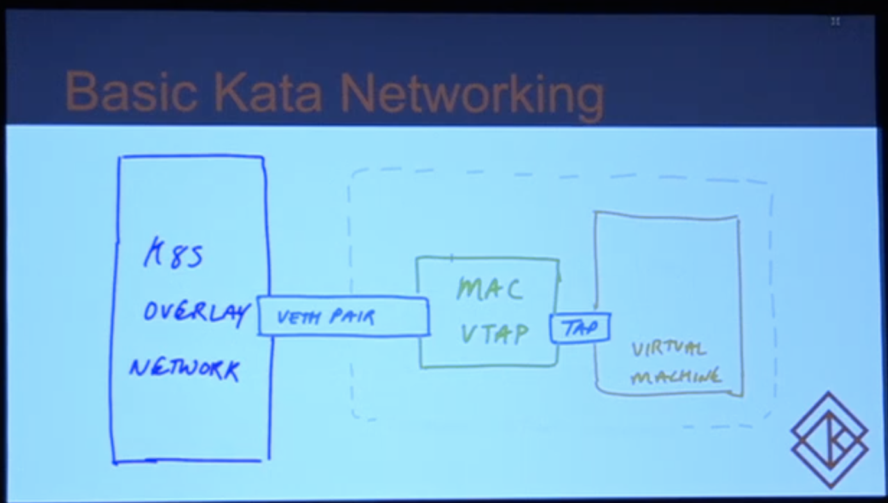

kubernetes + docker

## kubernetes

### Pod、Service、Deployment

[参考资料1](https://blog.csdn.net/qq_40597962/article/details/124847911)、[参考资料2](https://blog.csdn.net/THMAIL/article/details/107312208)

### PV和PVC

[参考资料1](https://blog.csdn.net/weixin_46837396/article/details/122159306)、[参考资料2](https://blog.csdn.net/qq_42527269/article/details/123348981)

### 端口映射

1. 宿主机
2. 集群内

### 配置文件

[参考资料1](https://juejin.cn/post/7107251448034885639)

### Alertmanager

这个是和prometheus一起的做监控+告警的。它本身算是一个告警的过滤器？目前了解的能做告警分组、告警的层级覆盖这种。不过感觉规则上能做的比较有限？

## docker-compose

新出镜像，重启服务（docker-compose up -d），单纯restart并不会基于新镜像起容器，只是会让老的容器重启

## Docker，containerd，CRI，CRI-O，OCI，runc

[层级结构相关资料](https://cloud.tencent.com/developer/article/1988350)

## kata

框架结构：

