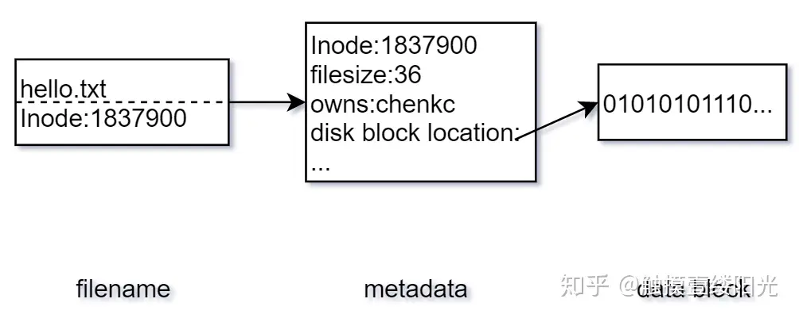
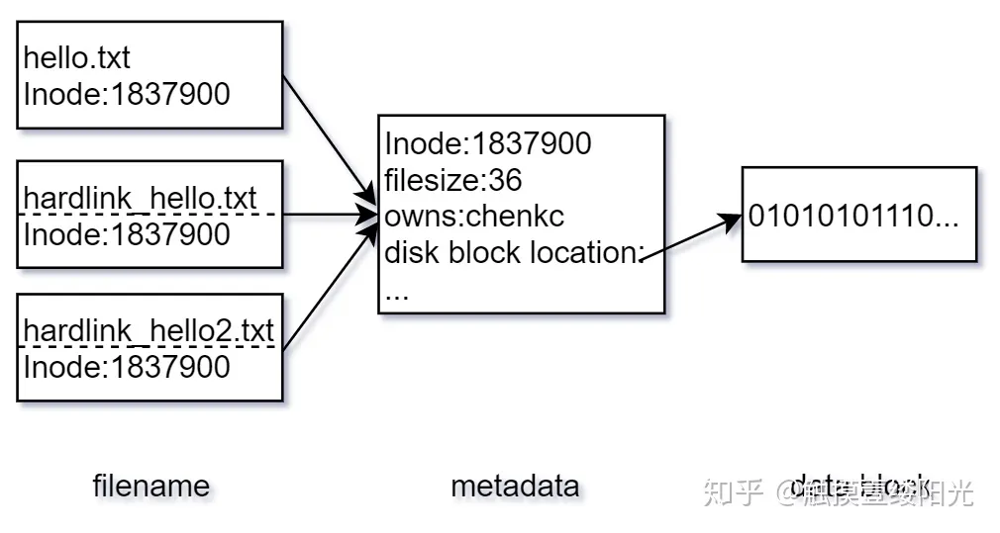
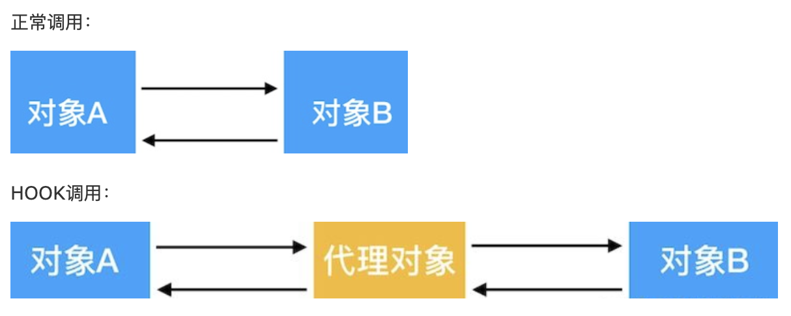

## 上传文件失败——HTTP 413

### 问题描述：

脚本向服务器发送报文时上传失败，HTTP状态码413报错

HTTP 响应状态码 **`413 Content Too Large`** 表示请求主体的大小超过了服务器愿意或有能力处理的限度，服务器可能会关闭连接或返回 [`Retry-After`](https://developer.mozilla.org/zh-CN/docs/Web/HTTP/Headers/Retry-After) 标头字段。

此错误通常出现在使用http请求进行文件上传的时候，因为上传文件容易出现大文件，比如超过5m的。

该问题出现于图像数据以本地脚本上传至服务器的过程中，请求以requests.post实现，请求内容在

```python
requests.post(xxx, files:{file:{xxx}})
```

[requests文档](https://requests.readthedocs.io/en/latest/api/?highlight=post#requests.post)

出现问题的文件大小约为2.2M，独立一个文件（pydicom）。

chat求助：


### 解决：

经过检查，问题来源于nginx。通过输出返回（报错413）报文的content，发现与nginx有关。经过检查，发送post请求的端口是打到前端去了...（究级猪鼻> ^ <）将请求的端口改成后端后，请求正常完成。

其实也就是只要在requests里面用的是files参数去传文件，不是特别大的情况下不会出现413问题。

另外查了一下nginx相关的参数，可以在http中设置client_max_body_size这个参数的值用于对转发报文的请求体大小进行限制，其默认值为1M（所以也就是为啥别的文件500多K没事，这个里面有一个2M这样的就出问题了）

**==TODO：请求发送到前端，nginx向后端转发的机制==**

## Windows（10）下使用python的tarfile打包tar.gz失败（数据类型错误/数据内容不完整）

### 问题描述：

之前上传数据的脚本在linux服务器上运行时一直正常，但是在我&另一位用了windows上传之后，多次出现上传失败报错。经过debug确定为本地打包数据时出现问题，在本地及服务器上都无法打开出现问题的压缩包。

之后需要在linux服务器上进行控制变量，尝试上传相同批次的数据是否能够复现报错。

初步猜测是windows打包tar.gz文件的过程中因为格式问题导致出现的偶发报错（是的，并不是100%失败）。自己想的初步解决思路是本地直接就近重试打开以判断是否打包失败，但是还需要确定两个问题，一个是打包的过程中间已经出现问题卡死，还是打包部分正常运行完，但是后续无法再解压打开（目前倾向于后者，所以考虑就近重试）。当然就近重试还有一个问题就是会不会重试依然失败，即需要明确导致失败的原因和场景。

### 解决：

```python
# TODO
```

猜测是打包的过程中文件头出现了问题。查找后发现，文件头有多种类型，如下：


不过在修改tarfile.open的format读取参数之后，似乎还是会有出现压缩包数据错误的现象。（从文件尺寸上来看，似乎压缩包中的内容也不完整）

目前采用的解决方案是原地进行一次解压获取，就近重试并捕获异常，从而确定数据被正常压缩并且可以打开。对打开的tarfile文件使用getmembers方法可以获取其中的内容信息（用于判断得到的压缩包是否正常）。

概率性问题，先分步拆解问题，定位具体出错在哪；然后考虑成功和出错的差异是什么。当然这里面还是需要一些经验的，文件头出错其实之前有碰到过，还是要积累总结。

## kubernetes集群环境下，pytorch训练卡顿的可能原因排查

### 问题描述：

深度学习在集群环境下进行（分布式）训练时，训练任务出现卡顿（1. 训练正常进行但是速度较平常慢；2. 训练中的某些轮次长时间未继续执行下去，但在操作或等待很长一段时间后重新回复，在此期间对该任务所在节点的其它任务产生了影响；3. 训练中的某些轮次完全卡住无法继续执行下去，并且对同一节点上的其它任务产生了影响）

### 排查：

这个因为牵扯到太多因素了，所以不指望能彻底解决，可以降低发生的频率感觉就很好了。

#### 可能的原因1：

pytorch的dataloader中设置了过大的num_workers。由于dataloder在取数据（和做预处理）的过程中是异步的，大致的思想是有num_workers+1个worker分别取数据并处理，然后弄完丢到一个池子里面。等到迭代的时候（get_item）再从池子里面取出来。那么因为worker之间并不能够主动去分辨哪个任务更为紧急，所以就会出现某一个batch的数据马上就要用了，但是还没在池子里，那么就会出问题。这个可能和起了多个进程（num_worker起一个进程）然后产生的上下文切换啥的有关系？具体还需要等到之后的实验跑了才能确定，不过在num_worker大于申请核心数的情况下，确实会出现上面所描述的情况。这种情况直接导致的应该是卡顿的第一种情况，或者介于第一种情况和第二种情况之间。不过在硬性限制能够使用的cpu核心数之后，这个问题应该不会再影响到同一节点上的其它用户（待确认）。

这个问题经过实验之后感觉非常玄学，即pytorch的num_workers的设置较大（如大于等于16）时，进行训练就可能产生资源的竞争，进而引发一系列问题。所以一种比较简单的解决方法就是不开num_workers或者设置的比较小，不过这样确实会对训练的速度（主要是数据加载上的瓶颈）产生影响。另外就是设置的num_workers比实际核心数大一阶2的倍数，似乎影响的情况并不明显？（这个最好之后再能跑实验进行一个验证，目前采用的是cpu的使用率限制，应该还可以用cgroup进行更为细致的核心限制；[cgroup参考资料1](https://zhuanlan.zhihu.com/p/81668069)，[cgroup参考资料2](https://zhuanlan.zhihu.com/p/433327341)）

#### 可能的问题2：

在使用中观察到，卡顿过程中，物理机的某些CPU核心存在长时间100%占用无法释放的情况。这个现象可能是由k8s的调度策略所导致的，但是暂时还未经过实验验证；另一种猜想是由系统内核造成的。总之短期内并不太好解决这个问题，所以暂时采用终止并重启的方式去打破阻塞状态。

#### 可能的问题3：

速度慢可能和IO的读取速度存在一定的关联。之前的策略是从nfs上进行数据的读取，这中间存在着网络传输的时间开销。为了能够减少这部分的时间损耗，可以使用类似redis的形式在nfs上套一个缓存，即**Alluxio**（在 **文件系统-存储** 中叙述）。通过这个方式能够让数据的读取从远程nfs变为优先命中缓存。Alluxio先存放的本地的内存空间中，随后是本地磁盘，然后是集群不同节点的内存\磁盘，最后都不命中才会到远程nfs上读取。从目前的实验效果上来说，第一个Epoch之后的IO时间是有降低的（测试约10%-20%），不过这个暂时还没有验证数据淘汰可能引发的问题。技术手段上来说可以做一个了解。

#### ==可能的问题4==:

TLB shutdown

这个其实算看到的现象。

TLB与快表

```java
// TODO
```

## 正确的上线流程

1. 拉取自己的dev分支
2. 修改代码，并自测
3. 提交PR，合并至dev
4. dev合并至test
5. test分支跑jenkins出镜像
6. 镜像在测试环境测试
7. test合并至master
8. master分支跑jenkins出镜像
9. 生产环境上线

## 工具插件、脚本血泪史

不管是啥插件、脚本，就算是再临时性的东西都要留log！！！然后留的log一定要格式标准化一点，方便日后要统计或者分析的时候方便去扒（正则或者别的方式）。**==其实比较好的方式就是用logging==**

还有一个需要特别注意的就是，webhook或者别的报警的逻辑和日志的逻辑能拆分尽量拆分。不然报警里面到时候一堆需求改这改那，回头整理日志分析的时候一个是判断条件可能不统一，还有就是逻辑还得逆向处理。真得是把自己弄的想死。目前的感悟是，报警这种东西就专门归报警干，别和日志搅和在一起。报警只负责即时抓到问题，鬼才会管后面恢复记录啥的。而日志是要留完整信息的，后续会再捞出来分析统计。因此，就算像webhook这种报警能够在那个节点抓到日志，并且返回而且提示，这玩意也不适合直接当日志去使用！！！

***==可扩展性==***

## 语法糖

### 装饰器

本质是返回一个函数

### 闭包

```python
# TODO
```

## K8S强制删除POD

[参考资料](https://blog.csdn.net/ArdenL/article/details/129180078)

```bash
kubectl delete pod <podName> -n <nsName> --force --grace-period=0
```

## 进程的状态

### 进程状态为 D (Uninterruptible Sleep)

#### 什么是 D 进程？

[相关资料1](https://zhuanlan.zhihu.com/p/509807556)、[相关资料2](https://www.cnblogs.com/embedded-linux/p/7043569.html#:~:text=断开连接再登录，执行%20ps%20axf%20则看到刚才的%20df%20进程状态位已变成了%20D,，kill%20-9%20无法杀灭%E3%80%82%20正确的处理方式，是马上恢复%20NFS%20服务端，再度提供服务，刚才挂起的%20df%20进程发现了其苦苦等待的资源，便完成任务，自动消亡%E3%80%82)

#### 状态为 D 的进程如何处理

kill -9无法处理；考虑提供资源解除状态，不然的话就得重启了（貌似有那种修改线程状态的办法，但是比较危险？所以不用）

## mysql多表联查优化

主要是发现一个复杂的4-5表联查的接口超时（10s+）。有筛选条件的时候正常，搜索全部的时候超时。

这个最后看了逻辑，实际上有多做了一次select *的全表子查询，这个查询在有其它筛选条件的情况下是起作用的，但是在没有筛选条件时相当于白做了一次select *的全表查询，所以导致了超时。增加条件筛选之后回复正常。

[EXPLAIN的使用](https://blog.csdn.net/fsdfkjai/article/details/121770629)

这里正好顺便补充一下关于数据库多表联查优化相关的一些内容。

[**==参考资料==**](https://blog.csdn.net/qq_41708993/article/details/126235768)

## 虚拟机与容器

[参考资料](https://zhuanlan.zhihu.com/p/339709750)

- 安全性
- 隔离性

容器不依赖于操作系统，通过Linux的Namespace和Cgroups技术对应用程度进程进行隔离和限制。Namespace的作用是隔离，它让应用程序只能看到该Namespace内的世界；而Cgroups的作用是限制分配给进程的宿主机资源。对于宿主机而言，这些被“隔离”的进程与其他进程并没有太大的区别。

容器与rootfs，可参考**存储**中的rootfs相关内容

## VFIO

[参考资料](https://zhuanlan.zhihu.com/p/534574765)

关于上面资料的一个疑问：单机训练数据的流向与集群训练数据的流向，什么时候经过网卡，什么时候不经过网卡，如何优化？

参考资料里面的这两句话感觉怪怪的：

```
图中红线的部门，是两个 Context Entry 指向了同一个页表。这种情况在虚拟化场景中的典型用法就是这两个Context Entry 对应的不同 PCIe 设备属于同一个虚机，那样 IOMMU 在将 GPA->HPA 过程中要遵循同一规则
由图中可知，每个具有 Source Identifier(包含Bus、Device、Func)的设备都会具有一个 Context Entry。如果不这样做，所有设备共用同一个页表，隶属于不同虚机的不同 GPA 就会翻译成相同 HPA，会产生问题
```

我理解的是，指向同一个页表不一定是相同的内存地址，只不过是同一个虚机用同一个页表映射？虚机之间就有隔离性？


```java
// TODO
```

## /dev/null与/dev/zero

[相关资料1](https://www.cnblogs.com/pipci/p/11412082.html#:~:text=%2Fdev%2Fnull%20它是空设备，也称为位桶（bit%20bucket）或者黑洞%20%28black%20hole%29%E3%80%82%20你可以向它输入任何数据，但任何写入它的数据都会被抛弃%E3%80%82,通常用于处理不需要的输出流%E3%80%82%20（当然，它也可以作为空的输入流）%20%2Fdev%2Fzero%20该设备无穷尽地提供空字符（ASCII%20NUL%2C%200x00），可以使用任何你需要的数目%E3%80%82%20它通常用于向设备或文件写入字符串0，用于初始化数据存储%E3%80%82)

[相关资料2](https://zhuanlan.zhihu.com/p/50879912)

在类Unix操作系统中，设备节点并不一定要对应物理设备。没有这种对应关系的设备被称之为伪设备。操作系统运用了它们实现多种多样的功能，/dev/null和/dev/zero就是这样的设备，类似的还有/dev/urandom、/dev/tty等。

### /dev/null

在类Unix系统中，/dev/null（空设备文件或黑洞文件）是一个特殊的设备文件，所有写入其中的数据，都会被丢弃的无影无踪，/dev/null通常被用于丢弃不需要的数据输出，或作为用于输入流的空文件。这些操作通常由重定向完成。

```bash
cat /dev/null > /etc/hosts  # 将读取黑洞设备写入到/etc/hosts，表示清空hosts文件
```

### /dev/zero

和/dev/null类似，/dev/zero也是一个特殊的字符设备文件，当我们使用或读取它的时候，它会提供无限连续不断的空的数据流（特殊的数据格式流）。

/dev/zero文件的常见应用场景有二：

1. /dev/zero文件覆盖其他文件信息。

2. 产生指定大小的空文件，例如：交换文件、模拟虚拟文件系统等。

### /dev/urandom

`/dev/random` 和 `/dev/urandom` 是 Linux 上的字符设备文件，它们是随机数生成器，为系统提供随机数

[/dev/random 和 /dev/urandom 的原理](https://zhuanlan.zhihu.com/p/427489847)

### /dev/tty

[Linux系统：/dev/tty、/dev/tty0 和 /dev/console之间的区别](https://zhuanlan.zhihu.com/p/632099551)

`/dev/tty`文件是一个特殊的文件，代表当前进程的终端，它显示与当前 SSH 会话关联的终端。

## 训练服务器数据的流向（网卡）

```python
# TODO
```

## nvidia-container-runtime环境变量

NVIDIA_VISIBLE_DEVICES=all，该环境变量控制以nvidia-container-runtime为runtime的docker，在运行时将哪些显卡设备传入容器中。对于使用runc为runtime的docker，在运行时如果想要将显卡传入容器中，直接使用--gpus all参数即可。

## 2>&1

[如何理解Linux shell中的“2>&1”](https://zhuanlan.zhihu.com/p/47765176)

每个程序在运行后，都会至少打开三个文件描述符，分别是0：标准输入；1：标准输出；2：标准错误。

2>&1表明将文件描述2（标准错误输出）的内容重定向到文件描述符1（标准输出），为什么1前面需要&？当没有&时，1会被认为是一个普通的文件，有&表示重定向的目标不是一个文件，而是一个文件描述符

在调用脚本时，可使用2>&1来将标准错误输出重定向

### command > file 2>&1 
首先是command > file将标准输出重定向到file中， 2>&1 是标准错误拷贝了标准输出的行为，也就是同样被重定向到file中，最终结果就是标准输出和错误都被重定向到file中。

### command 2>&1 >file 
2>&1 标准错误拷贝了标准输出的行为（先拷贝的行为，但是此时标准输出的行为还没有重定向，所以此时标准错误的行为也是输出到终端。之后，标准输出行为才定向到了file。），但此时标准输出还是在终端。>file 后输出才被重定向到file，但标准错误仍然保持在终端。

## dd命令

dd命令，主要功能为转换和复制文件，用指定大小的块拷贝一个文件，并在拷贝的同时进行指定的转换。

[dd命令详解，语法，参数，dd示例](https://blog.csdn.net/wangzhicheng987/article/details/121923220#:~:text=dd命令%2C主要功能为转换和复制文件%E3%80%82%20在Linux中，硬件的设备驱动和特殊设备文件,也是文件；dd也可以直接读取或写入到这些文件%E3%80%82%20dd：用指定大小的块拷贝一个文件，并在拷贝的同时进行指定的转换%E3%80%82)

[linux下的dd命令使用详解](https://zhuanlan.zhihu.com/p/78414544)

## DDD（领域驱动设计，Domain-driven design）

[相关资料](https://zhuanlan.zhihu.com/p/109114670)

《领域驱动设计模式、原理与实践》

## 涉及数据库的业务实现原则

能不用联表查询就尽量不用，可以使用单表查询并在内存中拼接替代联表查询（内存操作的速度一定快于请求连接访问数据库）；保留必要的冗余，可以在业务中避免联表查询的发生。

## 对称加密与非对称加密

[相关资料](https://zhuanlan.zhihu.com/p/83644573)

对称和不对称指的就是**加密和解密用的秘钥是不是同一个**。

非对称加密用的是一对秘钥，分别叫做公钥（public key）和私钥（private key），也叫非对称秘钥。非对称秘钥既可以用于加密还可以用于认证

## 同一张表查询

同一张表的查询合并为一次，可以取出多个字段的值之后再在内存中处理

## GROUP_CONCAT

MySQL中group_concat函数
完整的语法如下：

group_concat([DISTINCT] 要连接的字段 [Order BY ASC/DESC 排序字段] [Separator '分隔符'])

[相关资料](https://blog.csdn.net/ys410900345/article/details/44828571)

**奇特的用法**：查询结果中的多个字段都需要做distinct就可以使用group_concat包裹一层之后返回查询结果。查询结果将会表现为一个字段，这个字段中使用逗号分隔所有的distinct结果值。


## rbac权限控制

[相关资料](https://zhuanlan.zhihu.com/p/158752542#:~:text=RBAC模型（Role-Based%20Access%20Control：基于角色的访问控制）模型是比较早期提出的权限实现模型，在多用户计算机时期该思想即被提出，其中以美国George%20Mason大学信息安全技术实验室（LIST）提出的,RBAC96%20模型最具有代表，并得到了普遍的公认%E3%80%82%20RBAC认为权限授权的过程可以抽象地概括为：Who是否可以对What进行How的访问操作，并对这个逻辑表达式进行判断是否为True的求解过程，也即是将权限问题转换为Who、What、How的问题，Who、What、How构成了访问权限三元组，具体的理论可以参考%20RBAC96%20%E3%80%82)

对于角色概念的理解：角色实际上是在描述多个权限的集合，借助角色这个桥梁，可以实现对用户持有权限的批量修改

### rbac with domain

见Casbin

## UML时序图规范

[时序图格式规范](https://zhuanlan.zhihu.com/p/342655946)

发送请求为实线，返回请求为虚线，同步消息为实心箭头，异步消息为方向箭头

[UML图 | 时序图（顺序、序列）绘制](https://zhuanlan.zhihu.com/p/422509874)

[UML时序图详解](https://zhuanlan.zhihu.com/p/629630251)

## Casbin

rbac的一种开源实现方式

[官方文档](https://casbin.org/docs/overview)

## 任务调度

airflow，phoenix，quartz

## 流式下载（边打包边下载）

首先吐槽下，这个东西并不能满足实际场景的需要。当数据量上升或者文件总容量增大时，还是会面临worker超时的问题。所以最终的解决方案，还是要做上传和下载的切块传输，将大文件切成二进制流，接收到之后再做拼接。

[参考资料](https://zhuanlan.zhihu.com/p/342915148)

```python
import os

from choir.core.web import Resource, request
from choir.core.web.typing import Response
from zipstream import ZipFile, ZIP_DEFLATED


class TestResource(Resource):
    __endpoint__ = '/test'
    root_dir = './data'

    def make_zip(self):
        files = [os.path.join(self.root_dir, path) for path in os.listdir(self.root_dir)]
        with ZipFile(mode='w', compression=ZIP_DEFLATED) as zip_file:
            for file in files:
                zip_file.write(file)
            for chunk in zip_file:
                yield chunk

    def get(self):
        return Response(
            response=self.make_zip(),
            mimetype='application/zip',
            headers={
                'Content-Disposition': 'attachment; filename=foo.zip',
            }
        )


__all__ = ['TestResource']
```

## python中的yield

[参考资料1](https://blog.csdn.net/mieleizhi0522/article/details/82142856)

[参考资料2](https://zhuanlan.zhihu.com/p/268605982)

感觉基本就是理解成返回一个迭代器，然后每次执行到yield拿个值断一下，然后下一次再从断的地方接着继续

## nginx代理上传下载

目前理解的最大意义是不需要占用后端的worker，从而避免了worker超时的问题。

### 上传

模块：[upload module](https://www.nginx.com/resources/wiki/modules/upload/)

[参考资料](https://zhuanlan.zhihu.com/p/616930747)

要通过Nginx实现文件上传，可以使用Nginx的upload module，该模块可以将上传的文件直接传递给后端服务器，从而减少了上传的时间和服务器负载。

### 下载

模块：[mod_zip](https://github.com/evanmiller/mod_zip)

[参考资料](https://blog.csdn.net/xiaofei0859/article/details/50817357)

`mod_zip`能够动态的构建zip包，这种动态体现在当Nginx作为**反向代理服务器**的时候，该模块能够根据上游服务器返回的文件列表来打包文件。`mod_zip`实际上是利用Nginx的`subrequest`功能，将`zip流`发送到客户端的，而且它实际上**只打包不压缩**，所以借助Nginx本身作为文件服务器的能力，该模块的内存占用十分少，对于上G的大文件也没有问题。zip文件本身是结构化的，可以自定义目录结构，所以对于`mod_zip`而言，要做的只是添加zip的头部尾部和zip内部的目录结构元数据而已，文件数据本身依靠Nginx自身的机制发送。

除此之外，还有如下两点：

- 由于使用`subrequest`机制，文件甚至可以不在Nginx的服务器本身，可以是上游服务器，甚至是互联网的远程服务器上
- 在添加crc校验后，`mod_zip`还能够支持HTTP的[Range](http://www.w3.org/Protocols/rfc2616/rfc2616-sec14.html#sec14.16)，支持断点续传（**这个有待验证，似乎没生效**）

nginx代理上传下载后产生的一些问题：

1. nginx挂载nfs目录权限问题：由于需要将数据写到nfs中，所以会在启动时对目录执行chown修改权限，而我们的nfs文件目录权限为nobody且不能修改。查阅后发现，nginx可以设置启动的用户，将启动用户修改为nobody实现正常访问。
2. 上传文件时需要设置nginx接受的请求体大小，默认为1M。此外上传模块本身还有一个请求体大小的参数，是由nginx创建的请求给后端时的请求体大小限制，这个应该是10M，之前写了太多路径这玩意居然也超了。
3. 下载的时候，模块的说明中是有写crc32可以做断点续传，标志就是返回的请求体中会有个range，但是实际试了暂时还没看到（暂时应该还不支持断点续传）
4. 下载的时候由于需要遍历目录将整个目录下的文件路径、相对路径、文件大小以及文件的crc32（可选）信息传给nginx，这个过程在文件数量非常多，文件目录结构非常复杂时会消耗大量时间，所以会面临一个gunicore的worker存活问题。（通过起线程池可以hack掉存活时间的限制）

## 软链接与硬链接

[详解 Linux 中的硬链接与软链接](https://zhuanlan.zhihu.com/p/259764423#:~:text=%E8%AF%A6%E8%A7%A3%20Linux%20%E4%B8%AD%E7%9A%84%E7%A1%AC%E9%93%BE%E6%8E%A5%E4%B8%8E%E8%BD%AF%E9%93%BE%E6%8E%A5%201%201.%20%E7%A1%AC%E9%93%BE%E6%8E%A5%20%E5%9C%A8%20Linux,%E4%B8%BA%20hello.txt%20%E6%96%87%E4%BB%B6%E5%88%9B%E5%BB%BA%E4%B8%80%E4%B8%AA%E8%BD%AF%E9%93%BE%E6%8E%A5%EF%BC%9A%20...%203%203.%20%E7%A1%AC%E9%93%BE%E6%8E%A5%E5%92%8C%E8%BD%AF%E9%93%BE%E6%8E%A5%E7%9A%84%E5%8C%BA%E5%88%AB%20%E6%9C%80%E5%90%8E%E6%9D%A5%E7%AE%80%E5%8D%95%E6%80%BB%E7%BB%93%E4%B8%80%E4%B8%8B%E7%A1%AC%E9%93%BE%E6%8E%A5%E5%92%8C%E8%BD%AF%E9%93%BE%E6%8E%A5%E7%9A%84%E5%8C%BA%E5%88%AB%EF%BC%9A)

在 Linux 文件系统中，一个文件被分成两个部分：元数据（metadata）与用户数据（user data）。元数据为文件的附加属性，如索引节点（Inode）、文件大小、文件创建时间、文件所有者等。**元数据中并不包含文件名，文件名仅仅是为了方便用户使用。Linux 文件系统为每一个保存在磁盘分区中的文件（无论什么类型）都分配一个索引节点号（Inode Number），索引节点号是文件在一个文件系统中的唯一标识，不同文件所对应的索引节点号是不相同的；**用户数据，即文件数据块（data block），文件数据块中以二进制的形式记录着文件的真实内容。



想要查看对应文件的索引节点号可以使用`ls -i`指令

```bash
ls -i hello.txt
```

- 硬链接不支持对目录进行链接，软链接支持对目录进行链接

- 硬链接不支持跨越文件系统，软链接支持跨越文件系统

### 硬链接

在 Linux 中允许多个文件名指向同一个索引节点号，而硬链接（hard link, 也称链接）指的是通过索引节点号进行的链接。可以通过`ln`指令为文件创建硬链接：

```bash
ln 源文件 链接文件
```



**如果删除硬链接对应的源文件，硬链接文件仍然存在，这是因为硬链接是有着相同索引节点号仅文件名不同的文件，因此，删除一个硬链接文件并不影响其他有相同索引节点号的文件。我们可以为重要的文件创建硬链接，这样即使错误操作误删了文件，也不会重要文件造成影响。**当文件没有任何文件名指向的时候，文件也会被删除，也就是此时的硬链接数为 0。硬链接相当于为文件创建了一个新的文件名，当删除其中一个链接的时候并不影响索引节点本身以及其它链接到该索引节点的文件名，所以这些链接是相对独立的，这也是为什么 Linux 中仅仅标识文件硬链接的数目，并没有显示的标识文件是否为硬链接文件的原因。

硬链接文件的大小就是实际文件的大小。

### 软链接

软链接（也称符号链接）可以看成是一个普通的文件，**只不过这个文件中的数据块存放的是源文件的位置信息。**可以通过为`ln`指令添加`-s`（s: soft 的意思）选项创建软链接：

```bash
ln -s 源文件 链接文件
```

删除软链接文件不会影响源文件，删除源文件会导致软链接文件失效。

软链接文件的大小只是存放信息的大小，跟实际文件大小无关。

PS：知乎那篇原文这里写的是存放了源文件的索引节点号，这个是错的，应该是存放了位置信息，实验证明了下。


可以看到`test.txt`文件的inode变了，而`test1.txt`依旧可以读到新的`test.txt`中的内容。

进一步证明存放的是文件位置，将`test.txt`移动位置后查看`test1.txt`的内容。


至此可以证明软链接记的是文件位置。（另外，文件夹也有inode，这表示文件夹也被视为文件）

## 文件hash计算——md5、crc32

### [md5](https://zhuanlan.zhihu.com/p/37257569)

**MD5**即Message-Digest Algorithm 5（信息-摘要算法5），用于确保信息传输完整一致。是计算机广泛使用的杂凑算法之一（又译摘要算法、哈希算法），主流编程语言普遍已有MD5实现。

MD5算法具有以下特点：

1、压缩性：任意长度的数据，算出的MD5值长度都是固定的（16进制数字串）。

2、容易计算：从原数据计算出MD5值很容易。

3、抗修改性：对原数据进行任何改动，哪怕只修改1个字节，所得到的MD5值都有很大区别。

4、强抗碰撞：已知原数据和其MD5值，想找到一个具有相同MD5值的数据（即伪造数据）是非常困难的。

MD5的作用是让大容量信息在用数字签名软件签署私人密钥前被"压缩"成一种保密的格式（就是把一个任意长度的字节串变换成一定长的16进制数字串）。

### crc32

CRC-32的校验值长度固定为8个字符。

**循环冗余校验（CRC）是用于检测数据损坏的错误检测码。**发送数据时，会根据数据内容生成简短的校验和，并将其与数据一起发送。接收数据时，将再次生成校验和并将其与发送的校验和进行比较。如果两者相等，则没有数据损坏。所述**CRC-32算法**本身**转换可变长度字符串转换成8个字符的字符串**。

## python中的and和or

[参考资料](https://blog.csdn.net/Echo_Zhang12/article/details/111330901)

python中的逻辑运算符有两种返回值，python运算符除了能操作bool类型表达式，还能操作其他所有类型的表达式。一些初学者可能没了解过运算符操作其他类型的表达式。并且返回的值也不止bool类型。下面我们就来详细了解and与or的两种用法。

### 运算bool类型

```python
a = 1>2 and 1<2; print(a) #输出结果为：False
b = 1>2 or 1<2; print(b) #输出结果为：True
```

返回值是bool类型

### ==运算其它类型==

| 运算符 | 含义   | 逻辑表达式 | 说明                                                  |
| ------ | ------ | ---------- | ----------------------------------------------------- |
| and    | 与运算 | a and b    | 如果a为False，a and b返回a的计算值，否则返回b的计算值 |
| or     | 或运算 | a or b     | 如果a为True，a or b返回a的计算值，否则返回b的计算值   |

基于“短路逻辑”

**在python中：None、任何数值类型中的0、空字符串、空元组()、空列表[]、空字典{}都被当作False，还有自定义类型，如果实现了`__nonzero__()`或`__len__()`方法且方法返回 0 或False，则其实例也被当作False，其他对象均为True。**

## gunicore的工作模式

[Gunicore的使用手册](https://zhuanlan.zhihu.com/p/463699772)

### Gunicore是什么：

Gunicorn 是一个 Python 的 WSGI HTTP 服务器。它所在的位置通常是在反向代理（如 Nginx）或者 [负载均衡](https://link.zhihu.com/?target=https%3A//cloud.tencent.com/product/clb%3Ffrom%3D10680)（如 AWS ELB）和一个 web 应用（比如 Django 或者 Flask）之间。

然后继续套娃，WSGI是什么？

### [WSGI到底是什么？](https://zhuanlan.zhihu.com/p/95942024)

全称Python Web Server Gateway Interface，指定了web服务器和Python web应用或web框架之间的标准接口，以提高web应用在一系列web服务器间的移植性。

从以上介绍我们可以看出：

1. WSGI是一套接口标准协议/规范；
2. 通信（作用）区间是Web服务器和Python Web应用程序之间；
3. 目的是制定标准，以保证不同Web服务器可以和不同的Python程序之间相互通信

你可能会问，**为什么需要WSGI？**

首先，我们明确一下web应用处理请求的具体流程：

1. 用户操作操作浏览器发送请求；
2. 请求转发至对应的web服务器
3. web服务器将请求转交给web应用程序，web应用程序处理请求
4. web应用将请求结果返回给web服务器，由web服务器返回用户响应结果
5. 浏览器收到响应，向用户展示

可以看到，请求时Web服务器需要和web应用程序进行通信，但是web服务器有很多种啊，Python web应用开发框架也对应多种啊，所以WSGI应运而生，定义了一套通信标准。试想一下，如果不统一标准的话，就会存在Web框架和Web服务器数据无法匹配的情况，那么开发就会受到限制，这显然不合理的。

### gunicore的工作模式：

1. **sync 模式(同步工作模式)** 这是最基本的工作模式，也是默认的工作模式，线程为native类型。即请求先来后到，排队模式。
2. **eventlet 模式（协程异步）** eventlet 工作模式是基于eventlet库，利用python协程实现的。
3. **gevent模式（协程异步）** gevent是基于Greentlet库，利用python协程实现的。 
4. **tornado模式** tornado利用python Tornado框架来实现。
5. **gthread模式 gthread采用的是线程工作模式**，利用线程池管理连接，需要安装gthread库。 

各种工作模式的区别和对比：

```python
# TODO
```

## kubeflow的DDP任务通信

```python
# TODO
```

## tcpdump

同事debug了nginx请求S3拿不到结果tql（HTTP1.1和HTTP1.0版本不同，将nginx设置为HTTP1.1访问后即正常），膜一手，我也要学tcpdump

## conda配置cuda版本

```bash
conda install -c "nvidia/label/cuda-11.7.1" cuda-nvcc
```

## python的GIL

GIL（全局解释器锁，Global Interpreter Lock）

[深入理解Python中的GIL（全局解释器锁）](https://zhuanlan.zhihu.com/p/75780308)

GIL是Python的解析器之一CPython中的一个概念，是用来防止多线程并行执行机器码的互斥锁。

GIL的问题其实是由于近十几年来应用程序和操作系统逐步从多任务单核心演进到多任务多核心导致的 , 在一个古老的单核CPU上调度多个线程任务，大家相互共享一个全局锁，谁在CPU执行，谁就占有这把锁，直到这个线程因为IO操作或者Timer Tick到期让出CPU，没有在执行的线程就安静的等待着这把锁（除了等待之外，他们应该也无事可做）。

在一个现代多核心的处理器上，上面的模型就有很大优化空间了，原来只能等待的线程任务，现在可以在其它空闲的核心上调度并发执行。由于古老GIL机制，如果线程2需要在CPU 2 上执行，它需要先等待在CPU 1 上执行的线程1释放GIL（记住：GIL是全局的）。如果线程1是因为 I/O 阻塞让出的GIL，那么线程2必定拿到GIL。但如果线程1是因为timer ticks计数满100让出GIL，那么这个时候线程1和线程2公平竞争。但要命的是，在Python 2.x, 线程1不会动态的调整自身的优先级，所以很大概率下次被选中执行的还是线程1，在很多个这样的选举周期内，线程2只能安静的看着线程1拿着GIL在CPU 1上欢快的执行。

一个线程有两种情况下会释放全局解释器锁，一种情况是在该线程进入IO操作之前，会主动释放GIL，另一种情况是解释器不间断运行了1000字节码（Py2）或运行15毫秒（Py3）后，该线程也会放弃GIL。

首先来看第一种线程释放GIL的情况。假设现在线程A因为进入IO操作而主动释放了GIL，那么在这种情况下，由于线程A的IO操作等待时间不确定，那么等待的线程B一定会得到GIL锁，这种比较“礼貌的”情况我们一般称为“协同式多任务处理”，相当于大家按照协商好的规则来，线程是安全的，不需要额外加锁。

接下来，我们来看另外一种情况，即线程A是因为解释器不间断执行了1000字节码的指令或不间断运行了15毫秒而放弃了GIL，那么此时实际上线程A和线程B将同时竞争GIL锁。在同时竞争的情况下，实际上谁会竞争成功是不确定的一个结果，所以一般被称为“抢占式多任务处理”，这种情况下当然就看谁抢得厉害了。当然，在python3上由于对GIL做了优化，并且会动态调整线程的优先级，所以线程B的优先级会比较高，但仍然无法肯定线程B就一定会拿到GIL。那么在这种情况下，线程可能就会出现不安全的状态。

**如何避免GIL的影响**

有两个建议：

1. 在以IO操作为主的**IO密集型应用**中，多线程和多进程的性能区别并不大，原因在于即使在Python中有GIL锁的存在，由于线程中的IO操作会使得线程立即释放GIL，切换到其他非IO线程继续操作，提高程序执行效率。相比进程操作，线程操作更加轻量级，线程之间的通讯复杂度更低，建议使用**多线程**。
2. 如果是**计算密集型的应用**，尽量使用**多进程或者协程**来代替多线程。

## 数据库varchar长度

“超过64建议直接上text”

## 数据库hint

[新特性解读 | MySQL 8.0 新增 HINT 模式](https://zhuanlan.zhihu.com/p/69456261)

[MySQL的特殊关键字提示：hint](https://www.jianshu.com/p/dd90990fe9f1)

**何谓 hint：**

我们知道在执行一条SQL语句时，MySQL会生成一个执行计划，而hint就是告诉查询优化器需要按照我们告诉它的方式来生成执行计划。
Hint可基于表的连接顺序、方法、访问路径、并行度等规则对DML（数据操纵语言，Data Manipulation Language）语句产生作用，范围如下：

> 使用的优化器类型；
>  基于代价的优化器的优化目标，是all_rows还是first_rows；
>  表的访问路径，是全表扫描，还是索引扫描，还是直接用rowid；
>  表之间的连接类型；
>  表之间的连接顺序；
>  语句的并行程度；

## umask

[Linux权限控制命令—umask](https://zhuanlan.zhihu.com/p/414084702?utm_id=0)

## python的requests

python中requests库的post请求会将请求体body中的数据放在内存中，因此在上传数据时就可能出现OOM崩溃。为了避免这一问题可以使用requests-toolbelt库

[大文件上传requests-toolbelt](https://www.cnblogs.com/chiyun/p/17653549.html)：其中由于需求中有参数顺序的要求，因此特地还看了下，默认用dict不保证顺序，需要用OrderedDict或者tuple。

## 数据库连接保活

如果没有找到直接实现的保活方法/函数，可以考虑执行`SELECT 1`，注意需要调用`.scalar()`或者别的生效一下，不然用的可能是缓存。

## [sqlalchemy使用总结](https://blog.csdn.net/u012089823/article/details/94650310)

查询对象有这么几种方法`.one()`，`.all()`，`.scalar()`，`.one_or_none()`，`.get()`，以及`.first()`等。

- **`.all()`**

  返回查询到的所有的结果。
  这个方法比较危险的地方是，如果数据量大且没有使用`limit`子句限制的话，所有的结果都会加载到内存中。
  它返回的是一个**列表**，如果查询不到任何结果，返回的是空列表。

- **`.first()`**

  返回查询到的第一个结果，**如果没有查询到结果，返回`None`**。

- **`.scalar()`**

  这个方法与`.one_or_none()`的效果一样。
  如果查询到很多结果，抛出`sqlalchemy.orm.exc.MultipleResultsFound`异常。
  如果只有一个结果，返回它，没有结果返回`None`。

- **`.one()`**

  如果只能查询到一个结果，返回它，否则抛出异常。
  没有结果时抛`sqlalchemy.orm.exc.NoResultFound`，有超过一个结果时抛`sqlalchemy.orm.exc.MultipleResultsFound`。

- **`.one_or_none()`**

  比起`.one()`来，区别只是查询不到任何结果时不再抛出异常而是返回`None`。

- **`.get()`**

  这是个比较特殊的方法。它用于根据主键来返回查询结果，因此它有个参数就是要查询的对象的主键。
  如果没有该主键的结果返回`None`，否则返回这个结果。

## python中的OrderedDict

python中普通的dict是不会保留插入时的顺序的，所以如果需要用到插入的顺序，就得使用OrderedDict。

```python
data = [('a',1),('b',3),('c',2)]
ordered_dict = collections.OrderedDict(sort(data,key=lambda s:s[0]))  # 按数据中key值的大小排序
ordered_dict = collections.OrderedDict(sort(data,key=lambda s:s[1]))  # 按数据中value值的大小排序
```

这里面有用到lambda函数，在自定义结构体排序，比如`xxx.sort()`的时候，就可以用到。

## 什么是hook

[浅析什么是HOOK](https://www.cnblogs.com/ArsenalfanInECNU/p/12871887.html)

### Hook大概原理

创建一个代理对象，然后把原始对象替换为我们的代理对象，这样就可以在这个代理对象为所欲为，修改参数或替换返回值。



有时我们可能会理解不清什么是handle，什么是hook。总的来说，handle是对计算机资源（文件，设备，网络，窗口等等）的抽象表示。程序员可以通过handle来操作系统中的各类资源。而**hook指通过拦截系统或者应用中的事件，信号和调用，来更改系统或者应用的默认行为**。

## RESTful API设计规范

[参考资料1](https://juejin.cn/post/7025222833798119454)

[参考资料2](https://zhuanlan.zhihu.com/p/334809573)

RESTful API的URL具体设计的规范如下：

1. 不用大写字母，所有单词使用英文且小写。
2. 连字符用中杠`"-"`而不用下杠`"_"`
3. 正确使用 `"/"`表示层级关系,URL的层级不要过深，并且越靠前的层级应该相对越稳定
4. 结尾不要包含正斜杠分隔符`"/"`
5. URL中不出现动词，用请求方式表示动作
6. 资源表示用复数不要用单数，资源的命名必须是名词
7. 不要使用文件扩展名
