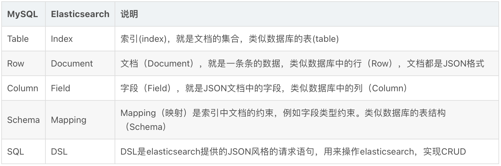

## Alluxio

```python
# TODO
```

## Elasticsearch

（ES的全文搜索强于mysql，因此在做关键字搜索的场景下，可以考虑用ES）

### Elasticsearch和mysql对比

[相关资料](https://blog.csdn.net/qq_41264674/article/details/120887911)

elasticsearch是面向**文档（Document）**存储的，可以是数据库中的一条商品数据，一个订单信息。文档数据会被序列化为json格式后存储在elasticsearch中：

而Json文档中往往包含很多的**字段（Field）**，类似于数据库中的列。



- Mysql：擅长事务类型操作，可以确保数据的安全和一致性
- Elasticsearch：擅长海量数据的搜索、分析、计算
- 对安全性要求较高的写操作，使用mysql实现
- 对查询性能要求较高的搜索需求，使用elasticsearch实现
- 两者再基于某种方式，实现数据的同步，保证一致性

## 存储池化技术

```python
# TODO
```

## rootfs（根文件系统）

[浅谈linux中的根文件系统（rootfs的原理和介绍）](https://blog.csdn.net/LEON1741/article/details/78159754)

根文件系统常用目录：

1. /etc/：存储重要的配置文件。
2. /bin/：存储常用且开机时必须用到的执行文件。
3. /sbin/：存储着开机过程中所需的系统执行文件。
4. /lib/：存储/bin/及/sbin/的执行文件所需的链接库，以及Linux的内核模块。
5. /dev/：存储设备文件。

### chroot

**chroot命令**用来在指定的根目录下运行指令。chroot，即 change root directory （更改 root 目录）。

[相关资料1](https://www.cnblogs.com/charlieroro/p/9259675.html)

[相关资料2](https://blog.csdn.net/hao707822882/article/details/39500549)

### multistrap

 debootstrap和multistrap是debian/ubuntu下的一个工具，用来构建一套基本的系统(根文件系统)，生成的目录符合Linux文件系统标准(FHS)。

[相关资料](https://blog.csdn.net/yikunbai5708/article/details/117070942)

## 透明大页（Transparent HugePages，THP）

[相关资料1](https://zhuanlan.zhihu.com/p/609457879)

透明大页之所以叫透明大页，是因是其对应用进程而言是透明的，如果虚拟内存足够大并且允许使用大页，那么内核在分配内存时会优先为其分配大页，如果大页分配失败，使用普通小页分配。（可以根据实际场景的需要自行设置分配策略及清理策略）

[相关资料2](https://zhuanlan.zhihu.com/p/364607279)：包含原理讲解，概括地来说，透明大页的出发点就是，减少TLB中页表项的数量、降低TLB Miss和缺页中断

[应用案例](https://github.com/numpy/numpy/issues/23266)：numpy1.22版本开始，numpy申请内存时会使用透明大页，如果不想使用可以通过环境变量将其关闭。

## FUSE

```python
# TODO
```

